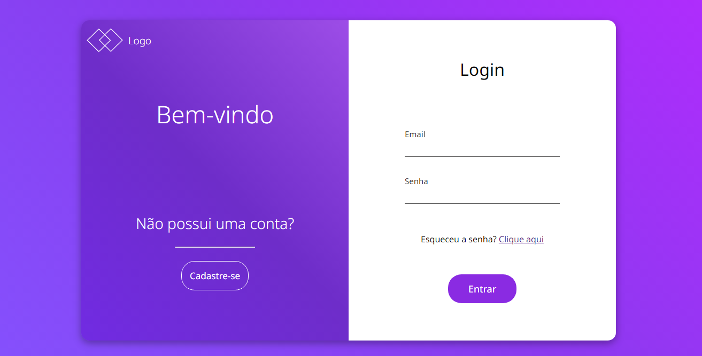
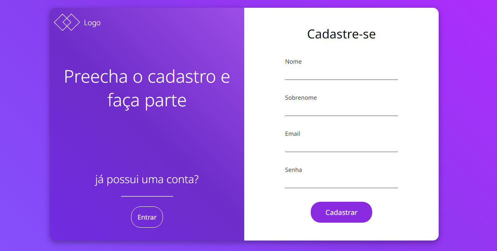

<h1 align="center"> Page: Login e Sing-up </h1>

Páginas de login e cadastro interligados entre si.

  <a href="#-tecnologias">Tecnologias</a>&nbsp;&nbsp;&nbsp;|&nbsp;&nbsp;&nbsp;
  <a href="#-projeto">Projeto</a>&nbsp;&nbsp;&nbsp;|&nbsp;&nbsp;&nbsp;
  <a href="#memo-licença">Licença</a>

  

 

    Página de Login
  

    Página de Cadastro
  

## 🚀 Tecnologias

Esse projeto foi desenvolvido com as seguintes tecnologias:

- HTML e CSS
- JavaScript
- Git e Github

## 💻 Projeto

O projeto da pagina funciona através de formulários e botões que direcionam para ambas as páginas  .

## :memo: Licença

Esse projeto está sob a licença MIT.

---
